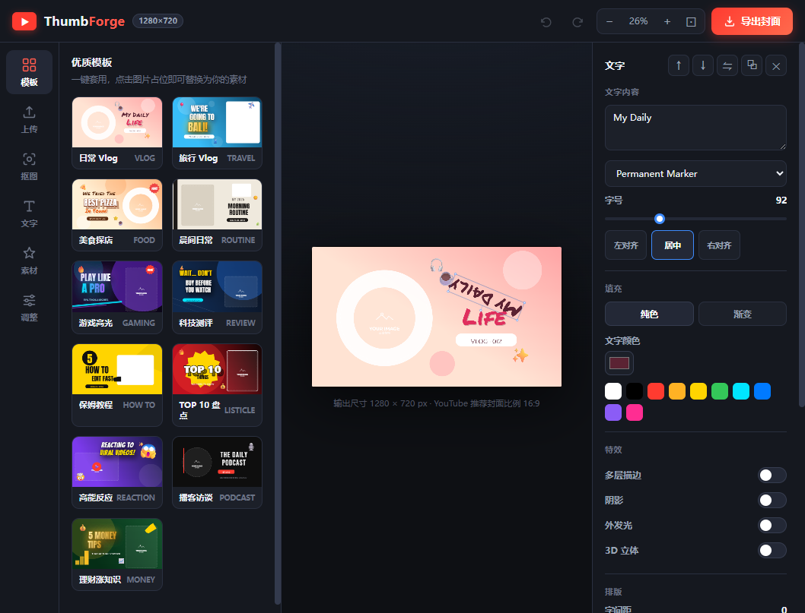

# ThumbForge — YouTube 封面设计器

纯本地、离线可用的 YouTube / VLOG 封面设计工具。打开浏览器就能用，无需联网、无需注册、无需安装依赖。



## 功能

- **11 套精选模板**：日常 Vlog、旅行、美食、游戏、科技测评、教程、盘点、Reaction、播客、理财等，一键套用
- **图片编辑**：上传本地图片、占位图点击替换、背景纯色/渐变/图片
- **AI 抠图**：内置 RMBG-1.4 本地模型（离线运行，注意：**该模型权重为非商业授权**；可切换 MediaPipe 人像分割，可商用）
- **图片特效**：描边、外发光、投影
- **文字系统**：12 款字体、纯色/渐变填充、**多层描边**（最多 5 层）、阴影、外发光、3D 立体、字距/行距/旋转
- **素材库**：常用形状、Emoji 贴纸
- **画布调整**：亮度/对比度/饱和度/模糊滤镜
- **图层管理**：上移/下移、锁定、复制、删除，撤销/重做（Ctrl+Z / Ctrl+Y）
- **智能磁吸**：
  - 拖动时自动对齐画布边界、画布中心线
  - 图层间互相对齐（文字对文字、文字对图片）
  - 旋转时自动吸附 0°/45°/90°/180° 等角度（按住 Shift 为 15° 步进）
- **视图缩放**：固定档位 + 点击百分比直接输入（10%–200%）
- **导出**：PNG / JPEG / WebP，1280×720（YouTube 推荐封面比例 16:9）

## 运行

**方式一（推荐）**：双击 `启动网站.bat`

脚本会自动检测端口、找到 Python、启动本地服务器并打开浏览器。关闭那个黑色窗口即停止网站。

**方式二（手动）**：

```bash
cd 项目目录
python -m http.server 8765 --bind 127.0.0.1
# 打开浏览器访问 http://localhost:8765/
```

> 需要电脑已安装 Python 3（安装时勾选 "Add Python to PATH"）。

## 技术栈

- 原生 JavaScript（ES Modules）+ Canvas 2D，**无框架、无构建步骤**
- 抠图：transformers.js v2 + ONNX Runtime Web（WASM），模型文件全部本地自托管（`vendor/rmbg/`）
- 所有数据保存在浏览器内存中，不上传任何服务器

## 目录结构

```
ybjpg/
├── index.html          # 页面结构
├── styles.css          # 样式
├── js/
│   ├── main.js         # 入口、UI 面板、事件绑定
│   ├── editor.js       # 编辑器核心：渲染、图层、磁吸、历史、导入导出
│   ├── templates.js    # 11 套封面模板
│   ├── constants.js    # 文字预设、形状、Emoji 等常量
│   └── bg-removal.js   # 本地 AI 抠图（RMBG-1.4 / MediaPipe）
├── vendor/rmbg/        # 抠图模型与运行时（自托管，离线可用）
├── 启动网站.bat         # 一键启动脚本
└── screenshot.png      # 界面截图
```

## 授权说明

- 本工具代码可自由使用
- **RMBG-1.4 模型权重**：版权归 BRIA AI 所有，采用**非商业授权**（个人/学习/研究可用，商用需联系 BRIA 获取授权）。如需商用，请在抠图面板切换到「MediaPipe（可商用）」引擎
